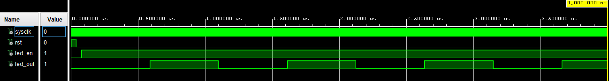
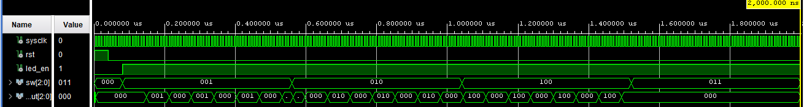

# 520-Lab1 — LED Blinker

## Overview

## Design Summary

## Verification and Results

Testbench starts with rst high and led_en low

With rst low and led_en high the output, led_out, flashes on and off. 
CLK_CYCLES_PER_TOGGLE was reduced for simulation

## Known Issues or Limitations

## References
